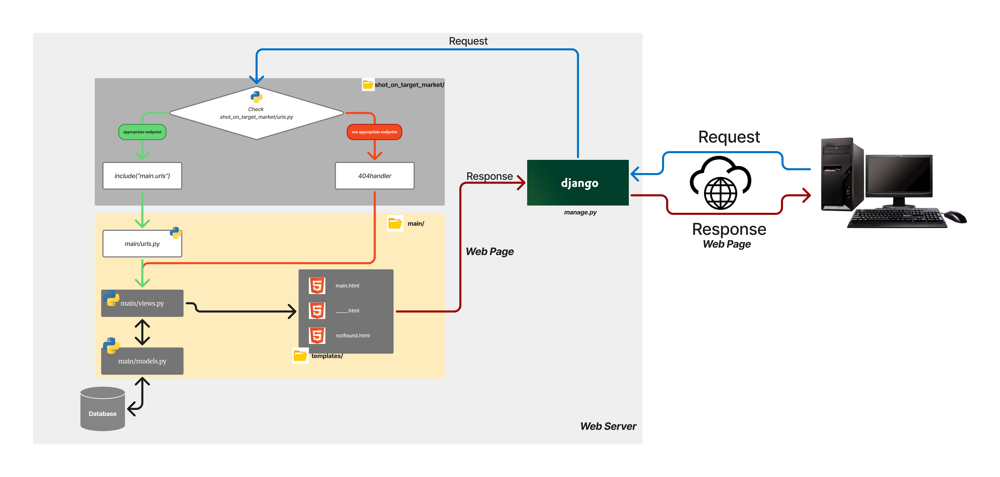
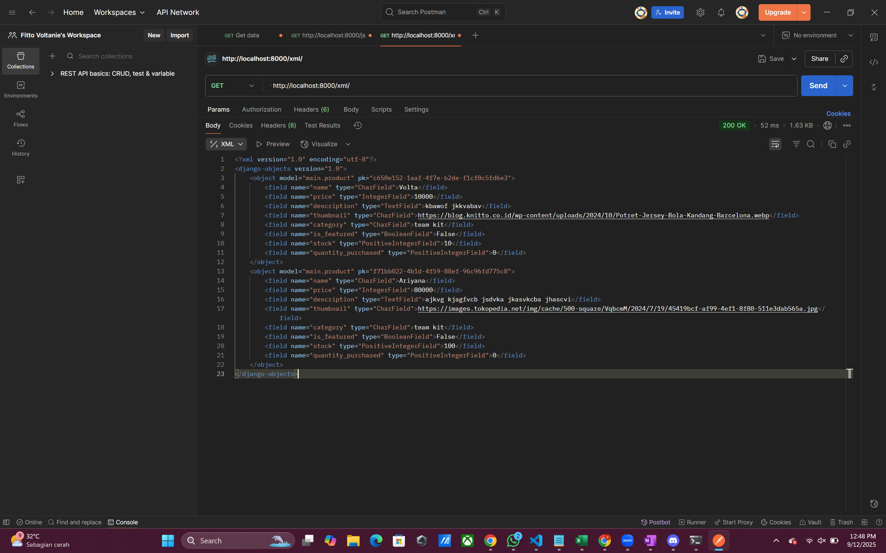
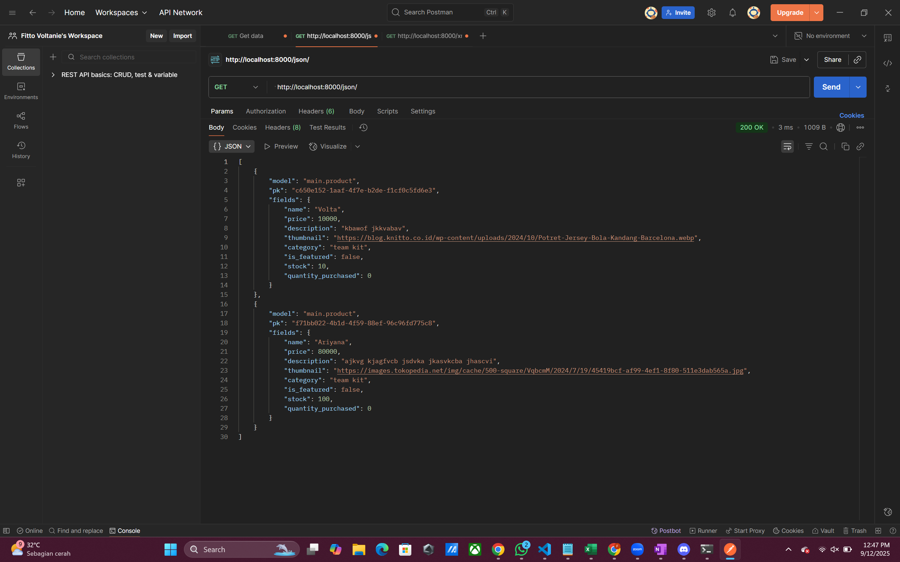
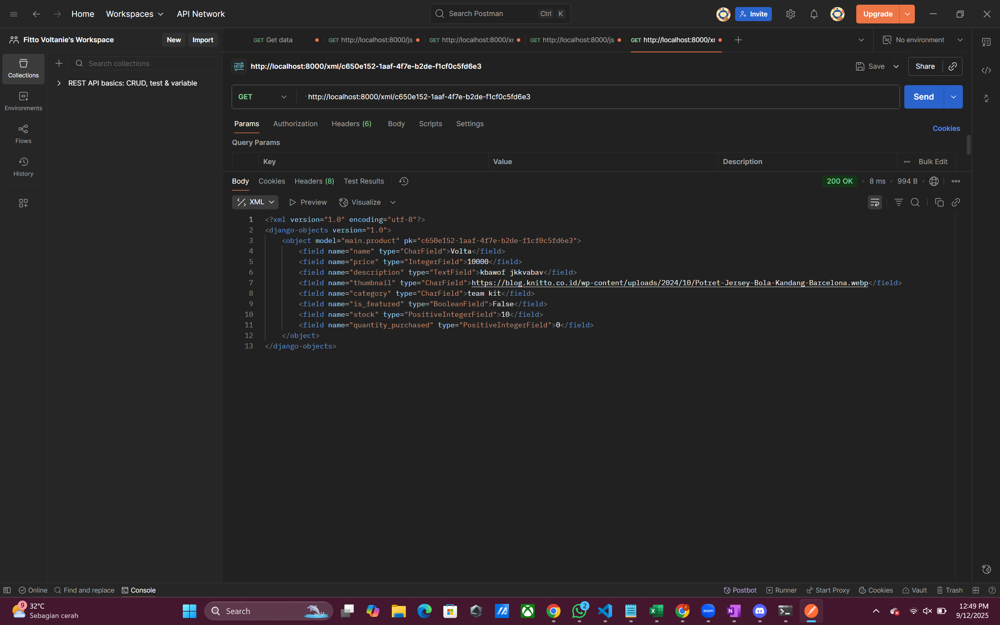
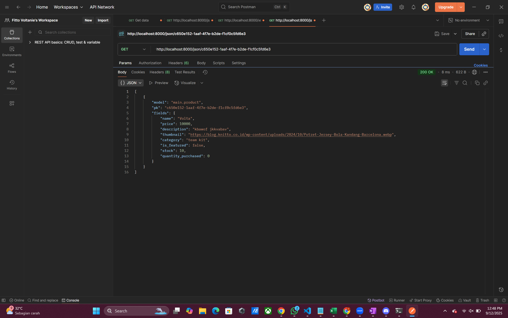

# <span style="color:blue; padding:10px">***[⚽SHOT-ON-TARGET🎯</span> <span style="color:red">MARKET🛍️</span>](https://fitto-fadhelli-shotontargetmarket.pbp.cs.ui.ac.id/)*** #
___
🔥*Your One-Stop Market, Always on Target!*🔥

🌐 https://fitto-fadhelli-shotontargetmarket.pbp.cs.ui.ac.id

Sebuah aplikasi web yang dirancang sebagai pusat belanja perlengkapan sepak bola dan olahraga. Di sini pengguna dapat menemukan berbagai kebutuhan mulai dari sepatu bola, jersey tim, perlengkapan pelindung, perlengkapan latihan, hingga aksesoris pendukung dengan kualitas terjamin.<br>
___

# <p align="center">**TUGAS 2**</p>

***Implementasi Proyek Django***
==
1. Hal yang paling pertama yang saya lakukan adalah membuat/menginisiasi proyek Django dengan men-*setting* beberapa *environtment* yang diperlukan, yakni *virtual environtment* dan *dependencies*-nya, saya melakukan hal berikut
- Membuat direktori pada lokal yakni <span style="background-color:#f0f0f0">*shot_on_target-market*</span> dan repositori github yakni <span style="background-color:#f0f0f0">*ShotOnTarget-Market*</span> (dapat diakses melalui [github berikut](https://github.com/Kyloo0/ShotOnTarget-Market.git))
- Mengaktifkan *Virtual environtment* untuk mengisolasi *package* serta *dependencies*
```
# di bash (Windows)
$ python -m venv env
$ env\Scripts\activate
```
- Membuat proyek Django dengan menginstall *dependencies*, yakni membuat *requirements.txt* di dalam direktori yang disiapkan. Di dalam file tersebut ditulis beberapa *dependencies* yang berfungsi untuk perangkat lunak yang ingin dijalankan, termasuk library, framework, atau package.
```
# membuat requirements.txt di direktori proyek

django
gunicorn
whitenoise
psycopg2-binary
requests
urllib3
python-dotenv
```
```
# di bash (instalasi dependencies)
$ pip install -r requirements.txt
```
- Setelah hal tersebut dilakukan, saatnya untuk membuat proyek Django dengan membuat proyek nya
```
# di bash (membuat proyek Django)
$ django-admin startproject shot_on_target_market .
```
Hal ini akan membuat sebuat *framework* dengan direktori baru bernama <span style="background-color:#f0f0f0">*shot_on_target_market*</span> di dalamnya. Saya juga membuat file <span style="background-color:#f0f0f0">*.env*</span> dan <span style="background-color:#f0f0f0">*.env.prod*</span>. Berikut tampilan isi direktori lokal
```
.
└── shot_on_target-market/
    ├── env/
    ├── shot_on_target_market/
    │   ├── _init_.py
    │   ├── asgi.py
    │   ├── settings.py
    │   ├── urls.py
    │   └── wsgi.py
    ├── .env
    ├── .env.prod
    ├── manage.py
    └── requirements.txt
```
- Selanjutnya saya mengonfigurasi *environtment variables* dan proyeknya dengan mengisi pada file yang telah diinisiasi, seperti
```
# di dalam .env
PRODUCTION=False
``` 
```
# di dalam .env.prod
DB_NAME=
DB_HOST=
DB_PORT=
DB_USER=
DB_PASSWORD=
SCHEMA=
PRODUCTION=True
```
Di dalam <span style="background-color:#f0f0f0">.env.prod</span> berisi konfigurasi terkait *Database* yang digunakan. Selanjutnya menambahkan baris-baris kode lainnya pada *file* <span style="background-color:#f0f0f0">settings.py</span>, seperti *load environtment variables* dari <span style="background-color:#f0f0f0">.env</span>, konfigurasi *variable* <span style="background-color:#f0ffff">**PRODUCTION**</span>, mengonfigurasikan host pada *variable* <span style="background-color:#f0ffff">**ALLOWED_HOSTS**</span>, dan mengonfigurasikan <span style="background-color:#f0ffff">**DATABASES**</span>-nya.

2. Membuat aplikasi baru <span style="background-color:#f0f0f0">***main***</span> dengan menjalankan perintah berikut
```
# di bash (Windows)
$ python manage.py startapp main
```
Setelah itu, akan terbentuk direktori baru <span style="background-color:#f0f0f0">*main*</span> yang berisi *file-file* berikut
```
.
└── shot_on_target-market/
    ├── ...
    ├── main/
    │   ├── _init_.py
    │   ├── admin.py
    │   ├── apps.py
    │   ├── models.py
    │   ├── tests.py
    │   └── views.py  
    └── ...
```
Setelah itu pada <span style="background-color:#f0f0f0">*settings.py*</span>, menambah <span style="background-color:#f0f0f0">***main***</span> ke dalam daftar aplikasi yang ada pada variabel <span style="background-color:#f0ffff">**INSTALLED_APPS**</span>.<br><br>
3. Membuat *model* pada file <span style="background-color:#f0f0f0">*models.py*</span>, yakni membuat *class* bernama *Product* yang berisi atribut dan logika-logika transaksi produk sederhana. Suatu produk khususnya dalam toko perlengkapan sepak bola memiliki
- Atribut : <span style="background-color:#f0ffff">***name***</span> [*CharField*], <span style="background-color:#f0ffff">***price***</span> [*IntegerField*], <span style="background-color:#f0ffff">***description***</span> [*TextField*], <span style="background-color:#f0ffff">***thumbnail***</span> [*URLField*], <span style="background-color:#f0ffff">***category***</span> [*CharField*], <span style="background-color:#f0ffff">***is_featured***</span> [*BooleanField*], <span style="background-color:#f0ffff">***stock***</span> [*PositiveIntegerField*],dan <span style="background-color:#f0ffff">***quantity_purchased***</span> [*PositiveIntegerField*]  
- Method : <span style="background-color:#f0ffff">***update_stock()***</span> [akan merubah nilai pada *stok* setiap ada pembelian], <span style="background-color:#f0ffff">***total_price()***</span> [menghitung total pengeluaran], dan <span style="background-color:#f0ffff">***is_featured()***</span> [mengetahui produk mana yang sering dibeli (lebih dari 10 kali)]<br><br>
Saya menerapkan beberapa konsep *Object Oriented Programming* pada pembuatan modelnya. Model bertugas untuk mengatur dan mengelola data pada sebuah aplikasi, dan pada Django sendiri, sudah disediakan *Object Relational Mapping (ORM)*<br><br> Saya juga melakukan testing sebelum melakukan migrasi ke *database*. Saya sudah membuat beberapa *Test Case* yang menguji fungsi atau *methods* pada kode model yag saya buat, dan menjalankannya pada bash Windows menggunakan perintah ```$ python manage.py test```
4. Melakukan migrasi setiap kali mengubah <span style="background-color:#f0f0f0">*models.py*</span> agar Django dapat melacak perubahan pada model *database*.
```
# di bash (Windows)
$ python manage.py makemigrations
$ python manage.py migrate
```

5. Membuat fungsi *view* pada file <span style="background-color:#f0f0f0">*views.py*</span> yang akan ditampilkan kepada *user*. Di sini, *views.py* saya berisi fungsi untuk menampilkan *page* ketika mengakses web dan menampilkan *page error* ketika terdapat *error 404*.<br>
```
...
def show_main_page(request):
    ...
def not_found_error_page(request, exception):
    ...
```
- Untuk menampilkan *page*-nya sendiri memerlukan sebuah *html*. Oleh karena itu, saya membuat direktori baru bernama <span style="background-color:#f0f0f0">***templates***</span> di dalam direktori <span style="background-color:#f0f0f0">*main*</span> yang berisikan dua file *html*, antara lain <span style="background-color:#f0ffff">***main.html***</span> yang akan di-*render* oleh fungsi <span style="background-color:#f0f0f0">***show_main_page()***</span> pada saat meangkses tampilan awal *web*-nya; <span style="background-color:#f0ffff">***notfound.html***</span> yang akan di-*render* oleh fungsi <span style="background-color:#f0f0f0">***not_found_error_page()***</span>  pada saat mengakses *page* yang tidak ada atau tidak didefinisikan pada proyek.<br> Misalnya, ingin mengakses https://fitto-fadhelli-shotontargetmarket.pbp.cs.ui.ac.id/infobeasiswa, akan menampilkan <span style="background-color:#f0ffff">***notfound.html***</span>. <br>
- <span style="background-color:#f0f000">Note:</span> Pembuatan  ***notfound.html*** dilakukan setelah menyelesaikan beberapa *checklist*. Ini bentuk eksperimen saya pada proyek ini. Terdapat kendala karena saat di-*test* menggunakan **localhost**, **DEBUG** (dalam *settings.py*) masih bernilai True. Sehingga saya ubah menjadi <span style="padding:1px;background-color:#f0f0f0">DEBUG=False</span>, dan menambahkan ***404handler*** pada <span style="padding:1px;background-color:#f0f0f0">*shot_on_target/urls.py*</span>. 
- Source: Saya menggunakan *search engine* untuk menemukan solusi dari kendala saya seperti pada [web berikut](https://docs.djangoproject.com/en/1.8/ref/views/#http-not-found-view) dan dari *AI*.

6. Membuat sebuah *routing*. *Routing* adalah proses memetakan suatu URL ke sebuah *view function* atau *class-based view* yang sudah didefinisikan.<br> Di sini saya ingin membuat *path*,
- *Path* <span style="padding:1px;background-color:#f0f0f0">''</span>, digunakan agar pada saat mengakses [page ini](https://fitto-fadhelli-shotontargetmarket.pbp.cs.ui.ac.id/) akan menampilkan html dari <span style="background-color:#f0ffff">***main.html***</span>, yakni menambahkan *file <span style="background-color:#f0f0f0">urls.py</span>* pada direktori <span style="background-color:#f0f0f0">*main*</span>, seperti berikut
```
...
urlpatterns = [
    path('', show_main_page, name='show_main_page')
]
```
- Selanjutnya melengkapi rute URL ke aplikasi <span style="background-color:#f0f0f0">*main*</span> dengan menambahkan <span style="background-color:#f0f0f0">*urls.py*</span> pada direktori <span style="background-color:#f0f0f0">*shot_on_target_market*</span>. Hal ini bertujuan agar proyek dapat melakukan pemetaan ke rute URL pada aplikasi <span style="background-color:#f0f0f0">*main*</span>, seperti berikut
```
...
handler404 = ...

urlpatterns = [
    ...
    path('',include('main.urls'))
]

```
- Impementasi ***handler404*** akan menangani ketika *path* yang diakses tidak dibuat oleh *developer*.<br>
7. *Deploy* ke PWS [(*Pacil Web Service*)](https://pbp.cs.ui.ac.id/) dengan tujuan agar *user* lain dapat melihat poyek yang dikerjakan. Proses *deploy* berarti memindahkan aplikasi dari lingkungan lokal (localhost) ke server/hosting sehingga aplikasi dapat dijalankan secara *online*. Berikut yang saya lakukan,
- Membuat akun dan *new project* pada PWS dan menyimpan *username*, *password*, dan *url* yang telah diberikan.
- Melakukan serangkaian konfigurasi terkait *database*, hal yang sama dilakukan ketika mengonfigurasi *environtment variables* pada awal pembuatan proyek.
- Menambahkan host dari server tersebut pada <span style="background-color:#f0ffff">**ALLOWED_HOSTS**</span> yang ada pada <span style="background-color:#f0f0f0">settings.py</span>
- Melakukan serangkaian *git command*, yakni <span style="background-color:#f0ffff">***git init***</span> untuk menginisiasi *git*; <span style="background-color:#f0ffff">***git remote add pws [https]***</span> untuk menambahkan *remote* untuk proyeknya; <span style="background-color:#f0ffff">***git branch -M [name]***</span> untuk membuat branch pada PWS; dan <span style="background-color:#f0ffff">***git push pws [branch_name]***</span> untuk *deploy* proyek melalui PWS.<br><br>

***Request Client pada Proyek Django***
==
<p align="center">  </p> 

Alur proses *request client* pada proyek Django adalah sebagai berikut
- *User* mengetikkan atau menekan sebuah *link URL*, lalu mengirim request ke server Django.
- Django (dengan melakukan *run <span style="background-color:#f0f0f0">manage.py</span>*) akan memproses request itu.
- Django memeriksa apakah *endpoint* yang diminta sesuai dengan pola *path URL* yang sudah didefinisikan.<br>**Bagaimana caranya?**<br>- Semua request masuk pertama kali ke <span style="background-color:#f0f0f0">*shot_on_target_market/**urls.py***</span><br>- Apabila *path* yang diberikan <u>cocok</u> dengan <span style="background-color:#f0f0f0">*include('main.urls')*</span>, maka akan diteruskan ke <span style="background-color:#f0f0f0">*main/**urls.py***</span><br>- Apabila *path* yang diberikan <u>tidak cocok</u>, maka akan ditangani oleh <span style="background-color:#f0f0f0">***handler404***</span><br><span style="background-color:#f0f000">Note</span>: <span style="background-color:#f0f0f0">*main/urls.py*</span> berfungsi menentukan view mana yang akan dijalankan sesuai URL yang cocok. Pada hal ini, <span style="background-color:#f0f0f0">*main/urls.py*</span> akan meneruskan *path* yang cocok dan meneruskannya pada fungsi di  <span style="background-color:#f0f0f0">*main/views.py*</span>
- Selanjutnya pada <span style="background-color:#f0f0f0">*main/**views.py***</span> akan diatur bagaimana aplikasi merespons setiap request yang masuk. Misalnya, fungsi <span style="background-color:#f0ffff">***show_main_page()***</span> akan menyiapkan *context* berisi data (seperti *name*, *npm*, dan *class*) lalu merendernya ke template <span style="background-color:#f0f0f0">*main.html*</span>. Sementara itu, fungsi <span style="background-color:#f0ffff">***not_found_error_page()***</span> digunakan untuk merender halaman khusus <span style="background-color:#f0f0f0">*notfound.html*</span> jika URL yang diminta tidak ditemukan. Pada <span style="background-color:#f0f0f0">*main/**views.py***</span> juga, bisa mengakses bisa mengakses <span style="background-color:#f0f0f0">*models.py*</span> untuk mengambil data dari database.
- Data context diteruskan ke template HTML menggunakan fungsi <span style="background-color:#f0ffff">***render()***</span>. Template HTML menampilkan data ke user dalam bentuk halaman web yang sudah terformat.
- Halaman web akan diteruskan sebagai *response*-nya<br>```Request → urls → View → Model → View → Template → Response```<br>

***Fungsi <span style="background-color:#f0f0f0">settings.py</span> dalam Proyek Django***
==
File <span style="background-color:#f0f0f0">*settings.py*</span> adalah pusat [konfigurasi utama](https://docs.djangoproject.com/en/5.2/topics/settings/) pada proyek Django. Semua pengaturan penting yang menentukan bagaimana aplikasi dijalankan disimpan di sini. Beberapa fungsi utamanya antara lain:
- Konfigurasi ke *Database*.<br>Pengaturan *database* perlu disesuaikan dengan lingkungan *production*.
```
...
if PRODUCTION:
    DATABASES = {
        ...
    }
else :
    DATABASES = {
        ...
    }
...
```
- Memuat daftar aplikasi (baik bawaan Django maupun aplikasi buatan sendiri yang akan digunakan) agar bisa di-*load* saat server dijalankan.<br>
```
INSTALLED_APPS = [
    ...,
    'main'
]
```
- Memuat  daftar host yang diizinkan untuk mengakses aplikasi web, salah satunya untuk *deployment*. Semua daftar host, dapat ditambahkan pada <span style="background-color:#f0ffff">**ALLOWED_HOSTS**</span>.
- Pengaturan lain dalam <span style="background-color:#f0f0f0">*settings.py*</span> mencakup aspek keamanan seperti *SECRET_KEY* dan *DEBUG*, pengaturan file statis (*STATIC_URL, STATIC_ROOT*) serta media (*MEDIA_URL, MEDIA_ROOT*), dan berbagai konfigurasi tambahan seperti *email*, *timezone*, bahasa, maupun *middleware* yang mengatur alur *request–response*.

***Cara Kerja Migrasi Database***
==
Migrasi model adalah cara Django melacak perubahan pada model *database*. Migrasi ini adalah instruksi untuk mengubah struktur tabel *database* sesuai dengan perubahan model yang didefinisikan dalam kode terbaru. Setiap kali terdapat perubahan pada model yang dibuat, saya melakukan migrasi ke *database*-nya agar dapat merefleksikan model saya. Berikut cara kerjanya,
- Membuat model-nya terlebih dahulu bertugas untuk mengatur dan mengelola data pada sebuah aplikasi. 
- Menjalankan perintah ***makemigrations***<br>```$ python manage.py makemigrations``` Setelah menjalankan perintah tersebut, Django akan membuatkan sebuah direktori bernama <span style="background-color:#f0f0f0">***migrations/***</span> dengan file di dalamnya yaitu <span style="background-color:#f0f0f0">***0001_initial.py***</span> yang berisi perubahan model yang belum diaplikasikan ke dalam basis data.
```
.
└── shot_on_target-market/
    ├── ...
    ├── main/
    │   ├── migrations/
    │   │   ├── __init__.py
    │   │   └── 0001_initial.py
    │   └── ...
    └── ...
```
-  Menerapkan migrasi ke dalam *database* lokal<br>```$ python manage.py migrate``` Dengan perintah ini, Django mengeksekusi file migrasi tersebut ke *database* sesuai konfigurasi di <span style="background-color:#f0f0f0">*settings.py*</span>. Hasilnya, tabel atau kolom baru akan dibuat, diubah, atau dihapus.

***Framework Django Sebagai Permulaan***
==
Beberapa alasan *framework* Django dijadikan permulaan pembelajaran pengembangan perangkat lunak adalah sebagai berikut,
- Bagi saya sendiri, *framework* ini cocok karena menggunakan bahasa ***python***, dimana secara sintaks sangat mudah dipahami.
- Django memiliki pola arsitektur **MVT** (*Model-View-Template*). Model bertugas untuk mengatur dan mengelola data pada sebuah aplikasi. View menangani logika yang akan ditampilkan kepada *user*. Template merupakan berkas HTML yang akan ditampilkan. MVT memiliki manfaat di antaranya,<br>- memisahkan logika aplikasi, tampilan, dan data secara rapi, jelas, dan mudah untuk dikelola.<br>- kode lebih terstruktur, modular, dan memudahkan untuk *testing*.<br>- template dan view dapat digunakan berulang kali (*reusable*).
- Django merupakan *framework* yang *open-source* sehingga dapat digunakan secara gratis.
- *Ridiculously fast*, Django memudahkan pengembangan aplikasi dengan cepat karena sudah menyediakan banyak fitur bawaan.
- *Fully loaded*, Django menyediakan fitur lengkap mulai dari autentikasi, ORM, routing, hingga admin panel.
- *Reassuringly secure*, keamanan yang disediakan Django cukup tinggi.
- *Exceedingly scalable*, yakni mampu menangani aplikasi kecil hingga skala besar.
- *Incredibly versatile*, sehingga bisa dipakai untuk berbagai jenis aplikasi web.

***Feedback***
==
Sebagian besar kode yang saya buat mengikuti [tutorial](https://pbp-fasilkom-ui.github.io/ganjil-2026/docs) yang telah disediakan. Pada tutorial tersebut, sudah cukup menjelaskan, membantu, dan memberikan pengalaman membuat suatu aplikasi dengan sangat menyenangkan. Saya sangat berterima kasih pada tim dosen dan asisten dosen yang membuat dokumen tutorial yang lengkap dan menyertakan penjelasan.

___
# <p align="center">**TUGAS 3**</p>
***Data Delivery Untuk Pengimplementasian Aplikasi***
==
***Data delivery*** sangat penting dalam implementasi platform karena memastikan data dapat dikirim dengan format data yang tepat dan sesuai agar sampai ke *user* atau sistem yang membutuhkannya. Umumnya, format file yang digunakan untuk data delivery dapat dibagi menjadi dua kategori utama, yakni text-based dan binary. Pemilihan format sangat bergantung pada kebutuhan, seperti ukuran file, kecepatan akses, dan kemudahan dibaca oleh manusia atau mesin.

Format berbasis teks seperti CSV, JSON, dan XML dikenal karena mudah dibaca oleh manusia dan memiliki kompatibilitas luas, menjadikannya ideal untuk pertukaran data melalui API atau untuk data tabular sederhana. Namun, format ini sering kali kurang efisien dalam hal ukuran file. 

Di sisi lain, format biner seperti Parquet dan Avro dirancang untuk efisiensi dan performa tinggi, meskipun tidak dapat dibaca oleh manusia, format ini sangat optimal untuk beban kerja analitik skala besar. Oleh karena itu, pilihan format file sangat bergantung pada kebutuhan spesifik proyek, seperti kebutuhan akan kecepatan, efisiensi penyimpanan, atau kemudahan pertukaran data.<br> Sumber: [ Huynh, A. V(2023, Januari 23)](https://medium.com/@vananhchic/different-types-of-data-delivery-file-formats-82228e5606c7)

***XML atau JSON? Mengapa JSON Lebih Populer?***
==
***Extensible Markup Language*** (XML) memungkinkan menentukan dan menyimpan data yang mendukung pertukaran informasi antara sistem komputer, seperti situs web, *database*, dan aplikasi pihak ketiga. Dengan struktur yang terorganisir dan aturan yang dapat ditentukan, XML memudahkan pengiriman data melalui jaringan sehingga sistem dapat memvalidasi dan membaca informasi secara akurat. Umumnya berbentuk seperti format HTML namun dengan isi *tag* yang dapat didefinisikan sebagai *variabel* yang diinginkan. <br><br>***JavaScript Object Notation*** (JSON) adalah format pertukaran data yang dibangun berdasarkan dua struktur, yakni kumpulan pasangan nama dan nilai. Struktur JSON terlihat layaknya sintaks *JavaScript* atau struktur data *dictionary* pada bahasa pemrograman *Python*.<br><br>
Berikut perbedaannya,
|Aspect|XML|JSON|
|---|---|---|
|Syntax|Markup-based with custom tags|Simple key-value pairs with brackets|
|Readability|More verbose| High |
|use case|Suited for document-style data|Ideal for APIs and lightweight apps|
|Format Size|Bulky|Compact|
|Data Type| Treated as text|Distinguish types|

Lalu mengapa ***JSON lebih populer?***<br>Yang pasti adalah mudah dibaca, hemat ruang, kompatibel, dan fleksibel. *JSON* menawarkan keunggulan terbaik dengan formatnya karena hampir semua browser modern yang tersedia sekarang, dapat memproses data JSON dengan lancar. Waktu yang dibutuhkan untuk memproses data *JSON* memang lebih sedikit, dan ini berkat format penulisan kodenya yang tidak memerlukan terlalu banyak karakter. Nah, yang paling penting adalah *JSON* mengatur cara kerja sebuah *API* dengan data yang terkandung di dalamnya.

***Fungsi Method ```is_valid()```***
==
Method tersebut ditemukan pada <span style="background-color:#f0f0f0">***main/views.py***</span>
```
...
def create_product(request):
    form = ProductForm(request.POST or None)

    if form.is_valid() and request.method == "POST":
        ...
    ...
```
Method ```is_valid()``` bertujuan untuk mengecek atau memvalidasi data-data dalam *form*-nya. Django Form memeriksa field yang wajib ada, membersihkan data dari string menjadi tipe Python yang sesuai, melakukan pemrosesan tambahan (misal memangkas spasi atau memilih objek model), serta memeriksa validasi dengan validator untuk setiap field, termasuk panjang, format, dan keunikan. Hanya setelah semua tahap berhasil, ```.is_valid()``` mengembalikan ```True```, dan **errors** berisi laporan semua kesalahan yang akan ditampilkan ke *user*.<br>Sumber: [Stack Overflow](https://stackoverflow.com/questions/73173747/django-form-is-valid-what-does-it-check) dan [Dokumentasi Django](https://docs.djangoproject.com/en/5.0/topics/forms/)

***```CSRF Token``` di Django***
==
Tag template CSRF memberikan perlindungan yang mudah digunakan terhadap *Cross Site Request Forgery*, yakni serangan yang memaksa *end user* untuk melakukan tindakan yang tidak diinginkan di aplikasi web yang telah terauntetikasi. Misalnya tidak sengaja mengklik tautan di situs berbahaya, sehingga *browsser* otomatis mengirimkan permintaan transfer.<br><br> Pada halaman dengan formulir yang ingin dilindungi, server akan menghasilkan string acak, ```csrf_token```, menambahkannya ke formulir sebagai kolom tersembunyi, dan juga mengingatnya, baik dengan menyimpannya di sesi atau dengan menyetel cookie yang berisi nilai tersebut. <br><br>Saat pengguna mengirimkan formulir, server hanya perlu membandingkan nilai kolom ```csrf_token``` yang diposting dengan token CSRF yang diingat oleh server. Jika kedua string sama, server dapat melanjutkan pemrosesan formulir. Jika tidak, server akan segera berhenti memproses formulir dan merespons dengan kesalahan. Saat view tidak me*render* template yang mengandung ```csrf_token``` (misalnya, saat menggunakan AJAX atau membuat formulir secara dinamis), Django mungkin tidak akan secara otomatis menyetel cookie CSRF.<br>Sumber: [Stack Overflow](https://stackoverflow.com/questions/5207160/what-is-a-csrf-token-what-is-its-importance-and-how-does-it-work) dan [Dokumentasi Django](https://docs.djangoproject.com/en/5.2/howto/csrf/)

***Implementasi Step-by-Step***
==
1. Mengumpulkan niat. Dorongan saya mengerjakan tugas ini adalah karena saya punya tugas lain yang menumpuk.
2. Melanjutkan proses implementasi dengan membuat ***data delivery***-nya terlebih dahulu, yakni ke dalam format XML dan JSON, dengan membuat fungsi pada *main/**views.py*** dan routing URL dalam *main/**urls.py***
```
# dalam main/views.py
def show_xml(request):
    ...
def show_json(request):
    ...
def show_xml_by_id(request):
    ...
def show_json_by_id(request):
    ...
```
```
# dalam main/urls.py
urlpatterns = [
    ...
    path('xml/', show_xml, name='show_xml'),
    path('json/', show_json, name='show_json'),
    path('xml/<str:id>/', show_xml_by_id, name='show_xml_by_id'),
    path('json/<str:id>/', show_json_by_id, name='show_json_by_id'),
    ...
]
```
3. Membuat template HTML yang sederhana sebatas untuk menampilkan data apa saja, seperti ```main.html```, ```product_form.html```, dan ```product_detail.html```. Saya membuat HTML-nya juga menggunakan skeleton template yang ada pada direktori *root* saya, sehingga file-file HTML tadi hanya perlu me-*extend* template dasarnya dengan mengganti konten dalam blok sesuai kebutuhan. Jadi, template ini mengurangi *redundansi*.
4. Setelah itu, saya mulai mengerjakan untuk membuat sebuah form untuk mendaftarkan produk baru di toko saya. *User* perlu untuk mengisi ```name```,```description```,```price```,```thumbnail```, dan ```stock``` sesuai dengan tipe data yang telah didefinisikan pada model.
5. Sempat terjadi beberapa error untuk *primary key* yang digunakan mengakses *attribute/values* dari objek Product yang telah dibuat. Saya menambahkan ```id``` pada model yang berperan sebagai *primary key*-nya. Saya harus mengulang proses migrasi.
6. Tentunya tidak lengkap apabila produk yang telah didaftarkan atau ditambahkan tidak untuk ditampilkan. Jadi saya membuat ```product_detail.html``` untuk menampilkan informasi detail setiap produk mulai nama, harga, stok, thumbnail dan deskripsinya. Untuk di halaman main sendiri, saya hanya menampilkan berupa thumbnail, nama, dan harga saja.
7. Menambahkan validasi csrf pada domain saya dengan menambahkan blok kode ```CSRF_TRUSTED_ORIGIN=[...]``` di ***settings.py***

***Feedback***
==
Sama seperti minggu kemarin, lab nya *doable* dan saya sangat berterima kasih pada tim dosen dan asisten dosen yang membuat dokumen tutorial yang baik. Sedikit saran untuk mendalami materi menarik yang tercantum pada tutorial, seperti *data delivery*, csrf, dan *query set* Django sebaiknya disertakan dokumentasi dari Django atau sumber-sumber lain yang jelas.

***Screenshot Postman***
==
<p align="center">
  
  
</p>
<p align="center">
  
  
</p>

___
Sumber materi 
--
- Dokumen [Django](https://docs.djangoproject.com/en/5.2/topics/settings/)
- Dokumentasi [tutorial](https://pbp-fasilkom-ui.github.io/ganjil-2026/docs)
- Introduction to the Internet and Web Framework [PPT]

*Tools*
--
- [Markdown Live Preview](https://markdownlivepreview.com/) untuk melihat tampilan README.md yang saya buat
- [Tree](https://tree.nathanfriend.com/) untuk membuat *directory graph*
- [Figma](https://www.figma.com/board/DyyTiiB2hHrAJuwnOJFQTe/Untitled?node-id=0-1&t=0ZObPeJ7a4oGYVIX-1) untuk membuat *request client graph*
___

